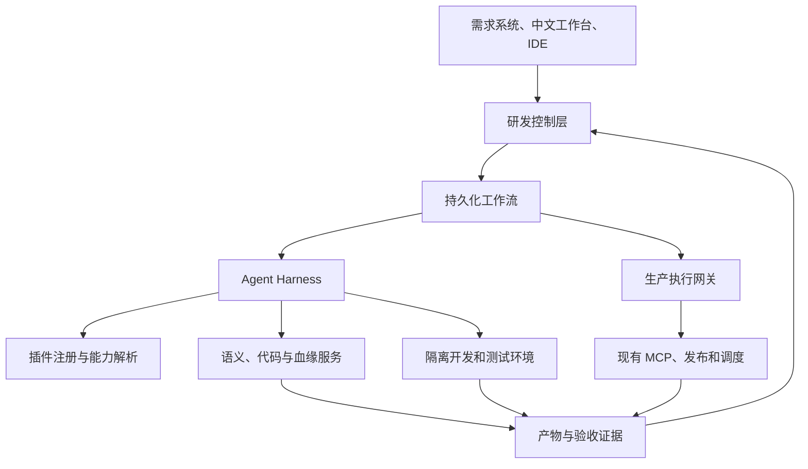
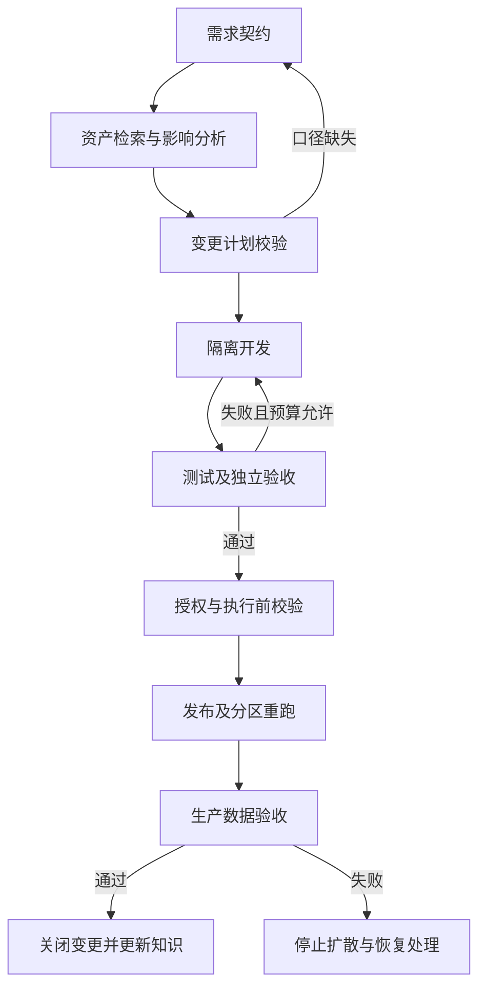
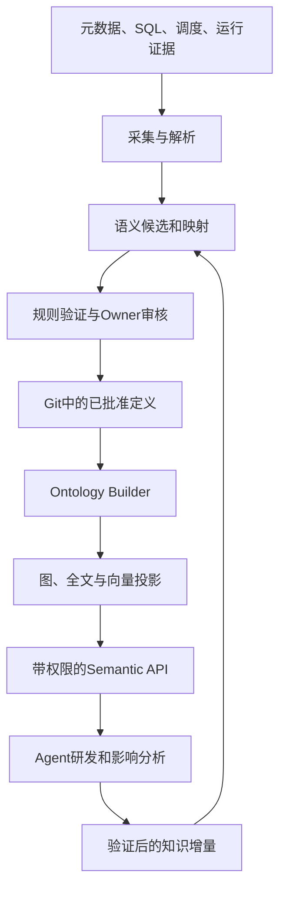
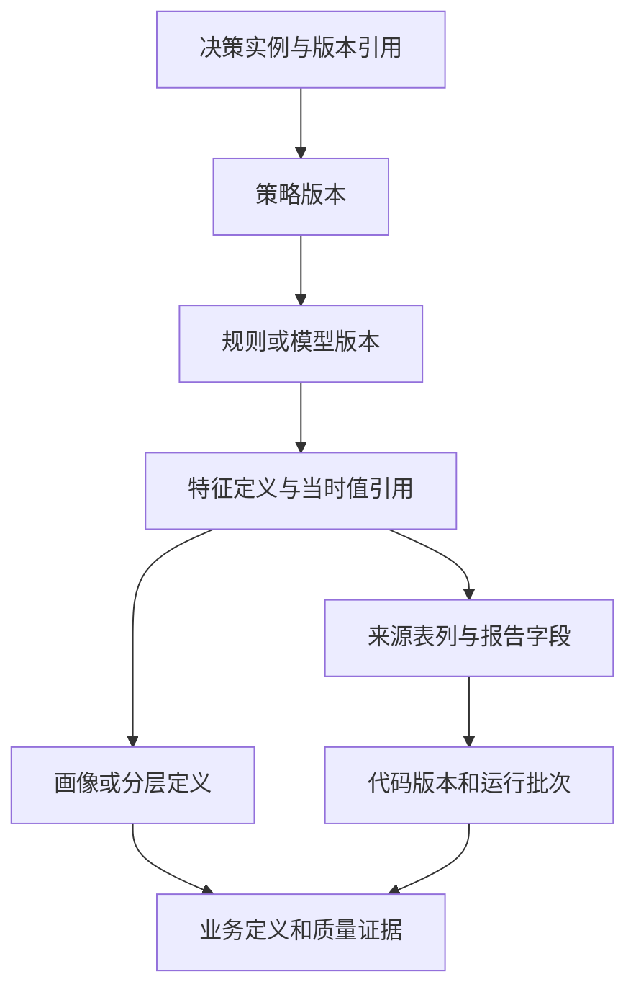
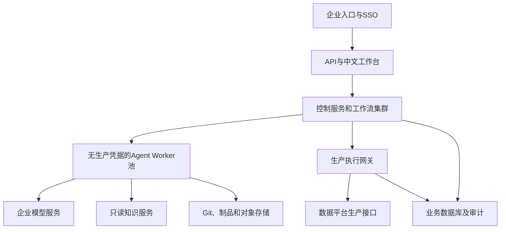
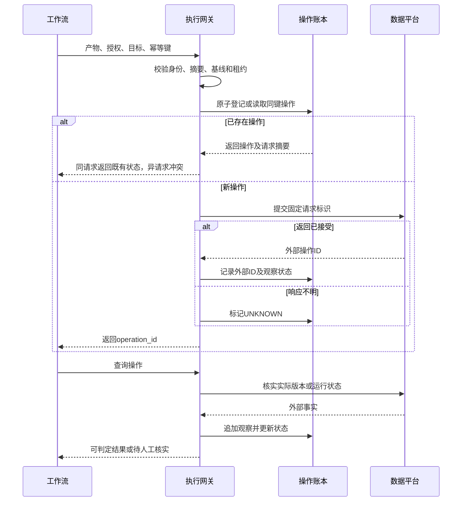

# AI+Data Harness 工程

## 企业级数据智能研发技术平台完整方案

**版本：** v1.0 · 历史详细设计参考；当前架构基线为 v1.1

**日期：** 2026-10-09  
**面向读者：** 数据研发负责人、平台架构师、数据工程师、AI 工程师、数据治理与生产运维团队  
**工程标识：** `ai-data-harness`  
**文档性质：** 可用于立项、架构评审、接口设计和研发拆解的设计方案；示例配置与接口是本工程拟定契约，不代表公司现有接口或已经完成的实现。

> **版本状态（2026-10-09）：** 本文保留为 v1.0 详细设计参考。当前架构归属、接入与实施路线以[技术方案 v1.1](AI-Data-Harness-Technical-Design-v1.1.md)为准：CLI 统一访问云端数字人，云端平台承载完整研发事项管理，AI-Data 提供领域能力与验收规则。本文原有“模型 SDK + 自建薄执行层”、独立工作台及部署目录、人员周数等不再作为默认建设任务。云端新增能力应按[平台能力要求与验收](Cloud-Digital-Human-Platform-Requirements-v1.0.md)核验；其余领域与可靠性约束按 v1.1 第 11 章映射继续使用。

> 工程定义：AI+Data Harness 是承载 AI 数据研发的控制与执行平台。它将需求、知识、代码、工具、工作流、权限、运行状态与验收证据连接起来，使一个涉及多节点的研发事项能够被规划、执行、验证、恢复和追溯。

## 目录

1. 背景、既有基础与设计假设
2. 建设目标、边界与原则
3. 总体架构与技术选型
4. 平台模块和职责边界
5. 核心对象、版本与存储模型
6. 研发工作流与状态机
7. Agent Harness 执行环境
8. 插件体系、依赖与生命周期
9. MCP 与现有平台接入
10. 语义中间层的生产与消费
11. 十万级节点检索、代码理解与影响分析
12. 修改、扩展与新增的决策机制
13. 开发、测试与独立验收
14. 发布、重跑、补偿与数据恢复
15. 生产权限、安全与审计
16. 贷前风控领域扩展
17. API、事件与持久化设计
18. 部署、容量、性能与成本
19. 可观测性、评测与运营
20. 团队工作方式与治理闭环
21. 实施路线、工作包与验收
22. 端到端案例
23. 关键架构决策与风险修复
24. 工程目录、文档拆分与交付清单
25. 上线前待核实事项
26. 技术依据与资料来源
附录 A：插件清单示例
附录 B：ChangeSet 示例
附录 C：语义定义示例
附录 D：核心 DDL 示例
附录 E：生产操作协议与恢复伪代码
附录 F：评审及验收清单

---

## 1. 背景、既有基础与设计假设

### 1.1 已知业务与技术背景

本方案继承此前讨论中的以下约束，不把它们当作需要重新建设的能力：

| 已知条件 | 对本工程的影响 |
|---|---|
| 数据仓库已有十多万个任务节点 | 必须按域、资产类型和变更范围增量处理，不能全量塞入模型上下文 |
| 节点命名存在歧义，代码量大，依赖复杂 | 资产识别必须同时依据稳定 ID、代码、元数据、语义与血缘 |
| 现有数据平台已提供 MCP 服务 | 通过适配器复用，不假定必须更换接口协议 |
| 已上线自动化发布 | 新平台负责编排和约束发布，现有平台继续执行发布 |
| 已具备任务依赖调度 | 复用数仓 DAG 调度，新增的是研发事项级工作流 |
| 一个需求经常涉及多个节点验证或重跑 | 使用跨节点 ChangeSet，显式管理节点与业务分区的执行范围 |
| 需要节点、表、字段、特征四类语义 | 知识模型不能只覆盖表级说明或 SQL 文档 |
| 特征可能是标量、时间序列或字段组 | 特征定义与物理列分离，通过版本化实现关系连接 |
| 关注贷前风险决策、画像、分层、征信报告 | 作为领域插件，复用通用研发底座 |
| 希望 Skill 与 MCP 依赖可迁移、可安装 | 引入插件注册、契约、依赖锁定和安装检查 |

已读取既有文件《Risk_Semantic_Layer_Design.md》，继承其 Business/Profile/Feature/Data/Code Ontology 分层和“YAML DSL → Ontology Builder → 图存储 → Semantic API → Agent”路径。该文件为语义总体设计，尚未定义生产工作流、幂等、并发和恢复的具体实现；本方案补齐这些工程部分。

此前提及的团队 AI 模式升级、v3 等讨论未获得完整原文。因此本文明确提出新的技术基线，不宣称已完整复刻那些未读取的版本。

### 1.2 尚未确认的条件

以下为待验证项：现有 SQL 方言、调度产品、MCP 工具清单、发布事务能力、版本查询接口、分区覆盖语义、企业 SSO、可用模型、内网部署约束、团队人数与资源预算。本文使用适配层隔离这些差异，并在第 25 章给出上线阻断条件。

### 1.3 为什么 Skill 不足以独立承载工程

Skill 提供操作方法和专业上下文；插件打包并分发能力；Agent 在任务内推理和调用工具。跨天等待、状态恢复、重复提交、并发修改、发布授权与审计，则需要平台的确定性程序机制。

| 概念 | 本工程中的定义 | 不承担的职责 |
|---|---|---|
| Skill | 可复用的方法、规则、模板及脚本入口 | 不作为生产授权依据 |
| Plugin | 版本化能力包，含 Skill、契约、适配器、测试和依赖 | 不天然具备事务与持久化能力 |
| Agent | 有工具边界的任务求解者 | 不自行宣告生产验收通过 |
| Harness | 管理上下文、隔离环境、工具约束、执行预算和产物 | 不替代数仓计算引擎 |
| Workflow | 管理研发阶段、恢复、等待和异常分支 | 不重复实现现有数据调度 |
| MCP | 标准化工具与资源接入协议 | 不自动解决业务权限、幂等和审批 |

## 2. 建设目标、边界与原则

### 2.1 目标

以“完整需求交付”作为最小业务闭环：自然语言需求 → 需求契约 → 资产定位 → 影响分析 → 研发计划 → 代码变更 → 测试 → 发布 → 重跑 → 验收 → 知识更新。

每个闭环应具备：

1. 可重建：运行依赖输入、代码、插件、策略和工具版本明确。
2. 可恢复：进程中断后从已确认步骤恢复，而非重新猜测状态。
3. 可控制：生产副作用经确定性授权和校验。
4. 可解释：资产选择、口径与影响范围有来源证据。
5. 可验收：完成依据是业务条件与运行证据，不是模型总结。
6. 可运营：持续评估正确率、返工、交付时间和成本。

### 2.2 范围与非目标

首期涵盖离线数仓 SQL 研发、任务配置变更、多节点发布及分区重跑。流式任务、在线特征和规则服务通过后续领域适配扩展。

不重建现有调度和数据计算引擎；不以知识图谱替代业务数据存储；不在首期一次性治理全部历史资产；不承诺任意复杂需求无人值守；不因两个字段名称相近就合并业务定义。

### 2.3 必须落实的架构原则

- **确定性边界：** Agent 输出候选方案，规则与程序验证后才能进入生产操作。
- **状态单一归属：** 工作流引擎掌管阶段推进；操作账本掌管外部动作；元数据源掌管资产事实。
- **不可变产物：** 测试、审批和发布都绑定内容摘要，避免“测的是 A，发的是 B”。
- **失败可见：** 未知结果进入核实状态，不能当作失败后直接重试。
- **增量知识：** 基于事件、内容哈希和依赖关系更新知识。
- **最小权限：** 每个任务仅获得指定工具、资产、环境、分区和时间范围内的权限。
- **分级自动化：** 低风险变更可由政策预授权，高风险变更按企业流程审核。
- **渐进部署：** 优先复用成熟组件，首期避免过早拆分大量微服务。

## 3. 总体架构与技术选型

### 3.1 逻辑架构



控制层管理“要做什么、当前完成到哪里”；Harness 管理“本次 Agent 如何执行”；现有平台管理“代码和数据实际上如何运行”。所有层通过不可变 ID 和版本引用连接。

### 3.2 建议技术基线

以下为建议选择，不是公司已部署产品清单。所有版本在 PoC 后锁定，部署时复核许可证、兼容性与内部支持情况。

| 能力 | 基线建议 | 选择理由与替代条件 |
|---|---|---|
| 中文工作台 | React + TypeScript，复用企业组件库 | 重点建设变更单、证据、执行时间线和差异对比 |
| 控制 API | Python FastAPI；现有 Java 主栈可用 Spring Boot | 团队语言统一优先，不为 AI 强制重写平台 |
| 持久化工作流 | Temporal，或满足第 6 章能力的既有引擎 | 跨天等待、恢复、超时和任务队列 [S1][S2] |
| Agent 执行 | 模型 SDK + 自建薄执行层 | 首期减少框架嵌套；复杂阶段可引入 LangGraph [S3] |
| 事务状态 | PostgreSQL，独立业务库 | 乐观锁、操作账本、唯一约束和 Outbox |
| 代码与 DSL | 企业 Git | 代码评审、不可变提交与语义版本 |
| 大型产物 | 企业对象存储 | 日志、证据、测试数据摘要及模型输出 |
| 血缘与语义图 | 先复用已有服务；不足时选 Neo4j 属性图 | 适合资产关系和局部路径；RDF 为互操作选项 |
| 检索 | 先用现有全文索引；可补向量索引 | 全文找标识符与代码，向量找语义候选 |
| SQL 分析 | 方言适配器，候选 SQLGlot 或现有解析器 | PoC 必须以实际 SQL/UDF/模板代码验收 |
| 权限策略 | 企业 IAM + 确定性策略服务 | OPA 等规则引擎按现有基础选配 |
| 可观测性 | OpenTelemetry 兼容埋点 + 企业监控 | 全链路关联，不引入第二套孤立运维体系 |
| 隔离运行 | Kubernetes Job 或现有受控容器平台 | 无生产凭据、有限网络与资源配额 |
| 插件产物分发 | 企业制品库或 OCI Registry | 版本锁定、摘要校验、签名和回滚 |

不要求同时引入图数据库、独立向量数据库、Kafka 和 LangGraph。优先补齐控制闭环，再根据实测瓶颈增加组件。

### 3.3 开发环境与生产环境分离

客户端插件只负责提交、查看、交互与本地开发辅助。跨阶段工作流和生产凭据驻留服务端，关闭 IDE 或会话不会停止研发事项。服务端 Worker 按任务拉取已批准能力包，在隔离空间执行。

## 4. 平台模块和职责边界

| 模块 | 主要接口/能力 | 权威数据与边界 |
|---|---|---|
| ChangeSet Service | 创建、修订、关联资产、查询 | 需求及配置版本，API 不直接修改工作流运行状态 |
| Workflow Controller | 启动、暂停、恢复、取消、信号 | 阶段状态的权威来源 |
| Harness Runtime | 上下文构建、模型调用、工具执行、产物提交 | 任务内状态，不持有生产发布权 |
| Plugin Registry | 发布、安装、依赖解析、禁用、锁定 | 插件版本及信任状态 |
| Semantic Service | 定义查询、实现映射、来源与版本 | 已审核语义及派生索引 |
| Impact Service | 字段影响、依赖裁剪、风险与缺口 | 生成版本化影响报告 |
| Policy Service | 校验计划、风险分类、授权决策 | 版本化规则，不执行模型自由判断 |
| Execution Gateway | 发布、运行、取消、状态核实 | 外部操作账本与幂等记录 |
| Evidence Service | 验证结果、审批绑定、完整性检查 | 不可变证据及失效关系 |
| Reconciler | 比较本地意图与外部实际状态 | 核实未知结果，不擅自重发危险操作 |
| Integration Adapters | MCP、Git、调度、SSO、元数据 | 翻译协议，不隐藏副作用语义 |

首期 ChangeSet、Evidence、Policy 和 Registry 可作为同一个模块化服务部署；生产网关、Agent Worker、工作流 Worker 分开部署并使用不同身份。达到资源或团队边界后再拆服务。

## 5. 核心对象、版本与存储模型

### 5.1 核心实体

| 对象 | 含义 | 关键字段 |
|---|---|---|
| RequirementContract | 明确业务定义与验收条件 | 粒度、窗口、单位、空值语义、时点、验收项 |
| ChangeSet | 一个完整研发事项 | 租户、域、需求版本、负责人、当前修订 |
| ChangeSetRevision | 不可变的一版研发输入 | 需求摘要、基线、插件锁文件、计划引用 |
| AssetRef | 物理或逻辑资产定位 | 系统、环境、稳定 ID、版本、分区 |
| ChangePlan | 多节点变更计划 | 操作 DAG、读写集合、风险、恢复策略 |
| TaskRun | 一次阶段任务执行 | 阶段、尝试序号、输入/输出摘要、预算 |
| Artifact | 代码、报告、配置等产物 | 类型、URI、摘要、生成来源、不可变版本 |
| Evidence | 对某项断言的验证结果 | 验收项、测试环境、输入快照、结果、有效期 |
| Approval | 人工或政策授权 | 主体、权限范围、产物摘要、时效、策略版本 |
| Operation | 外部副作用操作 | 幂等键、请求摘要、外部 ID、状态、租约代次 |
| SemanticAssertion | 语义断言或映射 | 来源、证据、置信信息、审核状态、有效期 |

### 5.2 对象类型与实例

`Customer` 是对象类型；`customer:123` 是业务实体实例。`FeatureDefinition` 是特征定义类型；`feature:overdue_count_90d@2` 是一项版本化特征定义；某客户某时点的特征值是 `FeatureObservation`。

元数据图默认存类型、定义、映射与运行引用，不复制所有客户、征信明细或特征值。实例查询通过受权限控制的数据服务完成。这样既保留此前 ontology 的表达能力，也避免把图数据库变成另一个数据仓库。

### 5.3 状态和数据权威来源

| 数据 | 权威来源 | 其他存储的角色 |
|---|---|---|
| 代码及审核后的 YAML 定义 | Git 提交 | 索引、缓存、图投影 |
| 发布版本和数仓任务状态 | 现有数据平台 | 操作账本保存观察和对应关系 |
| 工作流阶段状态 | 工作流引擎历史 | PostgreSQL 维护可查询投影 |
| 外部调用意图及幂等关系 | Execution Gateway 操作账本 | 工作流仅持有 Operation ID |
| 人工审批和策略授权 | 授权服务 | 工作流接收已验证授权信号 |
| 报告、日志、测试输出 | 内容寻址的对象存储 | 数据库存摘要与引用 |

工作流重放不重新查询模型决定历史分支。模型与外部 API 调用放入可记录结果的 Activity/任务中；工作流本身只根据已记录结果推进。[S1][S2]

### 5.4 版本绑定和失效

每份证据绑定以下组合：需求修订、计划摘要、代码提交、配置摘要、语义快照、输入数据快照或水位、验证器版本、环境。任一相关输入变更，依赖此证据的验收项标记为 `STALE`，关联审批不能继续用于执行。

对于只涉及注释的变更，可以由版本化规则判定无需重做数据测试；不能让模型自行决定沿用旧审批。执行前再次验证资产基线、授权有效期和策略撤销状态，防止检查与执行之间发生变化。

### 5.5 并发控制

ChangeSet 修订使用乐观锁。发布时按稳定资产 ID、环境和必要分区获取短租约，租约包含递增 fencing token；由目标适配器或网关执行路径验证旧租约不能继续写入。避免在等待人工审批期间长时间持锁。

两个需求的写集合重叠时排队或要求合并；一个需求的写集合影响另一个需求的读取假设时，重新进行基线检查。无法证明字段级互不影响时，按节点/表级保守处理。

## 6. 研发工作流与状态机

### 6.1 主工作流



固定阶段保证可治理；阶段内部允许 Agent 搜索、比较和修复。Agent 生成的任务 DAG 必须通过 Schema、无环性、操作白名单、资源预算和权限校验，不能直接作为工作流代码执行。

### 6.2 状态迁移契约

| 阶段状态 | 进入前提 | 完成证据 | 异常出口 |
|---|---|---|---|
| DRAFT | 已有需求描述 | 结构化需求契约 | NEEDS_INPUT |
| ANALYZING | 验收条件基本明确 | 候选、来源、影响报告 | BLOCKED、NEEDS_INPUT |
| PLANNED | 影响分析完成 | 校验通过的计划摘要 | NEEDS_REPLAN |
| DEVELOPING | 基线及插件锁定 | 代码和配置产物 | FAILED、PAUSED |
| VALIDATING | 产物可执行 | 测试证据集 | DEVELOPING、NEEDS_REPLAN |
| AWAITING_AUTHORIZATION | 所需证据均有效 | 人工或政策授权 | REJECTED、EXPIRED |
| READY_TO_EXECUTE | 授权已验证 | 基线、租约、预算检查 | STALE、BLOCKED |
| EXECUTING | 网关接受操作 | 发布与重跑记录 | RECONCILING、RECOVERY_REQUIRED |
| VERIFYING | 运行已结束 | 业务数据验收证据 | RECOVERY_REQUIRED |
| COMPLETED | 全部验收成立 | 完整交付清单 | 后续变化创建新修订或事项 |

`PAUSED`、`BLOCKED` 为可恢复控制状态；`CANCELLED`、`REJECTED`、`FAILED` 为终止结果。暂停只阻止新增动作；已提交的外部任务是否可停止由平台实际能力决定。取消后仍必须核实在途副作用，并记录“已取消且已恢复”或“已取消但需人工处理”。

### 6.3 重试分类

| 错误类别 | 处理 |
|---|---|
| 临时网络故障且只读操作 | 指数退避，带抖动和次数上限 |
| 模型限流 | 队列退让；经策略允许切换模型并记录版本 |
| 代码或业务断言失败 | Agent 修复，限定总轮数和预算 |
| 权限拒绝、Schema 不匹配 | 不自动重试，修正配置或转交 |
| 生产提交超时 | 转 RECONCILING，先核实外部状态 |
| 版本冲突、语义快照过期 | 重新分析并使旧证据失效 |
| 补偿失败 | 冻结后续动作，进入人工恢复队列 |

重试次数由错误类别和操作风险确定。多个层级不能各自无上限重试：工作流负责阶段重试，网关负责外部调用核实，SDK 仅做有限传输重试。

### 6.4 引擎选择与升级

已有引擎若具备持久化、外部事件、跨天等待、幂等任务、版本管理、可查询历史及故障恢复测试，可继续使用。单纯定时调度和 DAG 依赖并不必然满足这些条件。

采用 Temporal 时，外部 I/O 放入 Activities，不能假定 Activities 恰好执行一次。Worker 新旧版本并行保留，运行中的事项固定到兼容版本，先通过重放测试再升级。[S1][S2] LangGraph 若引入，仅负责阶段内子图，生产发布仍由主工作流和网关控制。[S3]

## 7. Agent Harness 执行环境

### 7.1 单次任务的完整生命周期

1. 接受已校验的 TaskSpec：目标、输入引用、允许工具、输出 Schema、截止时间及预算。
2. 校验任务身份和插件锁文件，构建最小上下文。
3. 创建独立工作区及容器，检出精确 Git commit。
4. 注入只读知识访问能力和沙箱工具；生产凭据不进入环境。
5. 执行检索、生成、分析及测试，逐步记录工具证据。
6. 检查产物 Schema、路径、摘要和必要证据。
7. 提交产物引用及简要推理依据，销毁临时凭据和环境。
8. 返回 `SUCCEEDED/FAILED/BLOCKED`，由主工作流决定下一阶段。

### 7.2 上下文包

ContextPack 包含：需求契约、资产卡片、相关代码片段、局部血缘、语义定义、企业标准、前序产物、已知未知项。每一项标注来源、版本、检索时间和访问范围。

上下文采用分层加载：先提供摘要和目录，再按稳定 ID 获取详情。压缩摘要必须保留原始引用。模型无法读取的内容不得被写成“已确认事实”。表名、字段名或节点名只能作为检索条件，不能代替稳定身份。

### 7.3 执行预算与终止条件

TaskSpec 设置最大模型调用数、工具调用数、SQL 扫描量、执行时长、费用和修复轮次。首期可将修复轮数设为 3 次作为试点参数，超过即提交失败报告；该值需根据实际任务复杂度调整。

停止条件包括：产物满足契约、预算耗尽、权限被拒、需求矛盾、数据不可得、插件撤销、人工取消。模型提出扩大权限或扫描范围只能成为申请，不能自动改变任务授权。

### 7.4 Agent 角色

可配置需求分析、资产分析、开发、测试解释、发布结果分析等角色。首期以单 Worker 的顺序角色调用为主。多 Agent 仅用于可独立的代码变更或交叉分析，所有协作通过产物契约交换，禁止共享可变工作区和相同生产凭据。

不能通过“再找一个模型确认”替代独立验证。模型评审帮助发现缺陷，业务规则、实际查询和可复现测试决定验收。

## 8. 插件体系、依赖与生命周期

### 8.1 两种插件形态

**客户端插件**提供命令、Skill、工作台入口、方案展示和会话辅助。可为不同 IDE/CLI 分别实现适配包，不假设不同厂商的插件清单格式兼容。Claude Code 的插件打包概念可作为客户端实现参考，不能当作本平台服务端规范。[S5]

**服务端能力插件**是可版本化部署的业务能力，包含执行程序、输入输出契约、工具映射、权限需求、评测数据、恢复策略和可选 Skill。必须允许工作流直接调用确定性函数，不要求每次都经过模型。

### 8.2 首批插件目录

| 插件 ID | 职责 | 必要输出 | 优先级 |
|---|---|---|---|
| `requirement-contract` | 口径解析、缺口澄清 | RequirementContract | P0 |
| `asset-discovery` | 元数据、代码和语义检索 | 候选列表及匹配证据 | P0 |
| `impact-analysis` | 字段/表/任务影响分析 | ImpactReport、未知边界 | P0 |
| `change-planner` | 修改/扩展/新增比较，多节点拆解 | ChangePlan DAG | P0 |
| `sql-development` | SQL 与任务配置开发 | Git diff、配置、实现说明 | P0 |
| `validation` | 编译、数据和回归校验 | EvidenceSet | P0 |
| `platform-release` | 调用现有发布系统 | Operation、发布版本 | P0 |
| `backfill-verification` | 重跑与生产验收 | 分区计划、运行证据 | P0 |
| `semantic-curation` | 语义候选与知识回写 | 可审核语义变更 | P1 |
| `governance-remediation` | 标准映射、重复资产治理 | 治理 ChangeSet | P1 |
| `credit-risk-domain` | 画像、分层、征信及风控语义 | 领域校验规则和资产映射 | P1 |
| `streaming-development` | 流式状态、检查点与升级 | 流任务变更及恢复计划 | P2 |

P0 为试点闭环必需，P1 为规模化或领域能力，P2 为扩展。P0 是能力优先级，不要求第一期拆成八个独立部署服务。

### 8.3 插件契约

插件标准必须覆盖：ID、版本、维护人、运行时、入口、输入输出 Schema、必选/可选依赖、工具需求、副作用类型、超时、重试、幂等、补偿、评测集、镜像摘要、签名与支持范围。附录 A 提供清单示例。

为防止重复声明冲突，插件描述的是“需要哪些权限”，实际授权由平台结合调用人、服务身份、ChangeSet、环境和政策计算。插件不能自授予生产访问权。

### 8.4 依赖解析

| 依赖类型 | 例子 | 处理规则 |
|---|---|---|
| 插件 → 插件 | planner 依赖 impact-analysis | 校验版本范围和有向无环依赖 |
| 插件 → MCP 能力 | release 需要 publish/status | 按能力与 Schema 映射，不只匹配工具名字 |
| Skill → Skill | SQL 优化方法依赖企业 SQL 标准 | 由能力包显式装配，避免隐式上下文依赖 |
| 插件 → 运行时 | SQL 方言解析器及容器镜像 | 锁版本和摘要，在 CI 构建，不在生产临时安装 |
| 插件 → 领域词典 | 风控口径与标准 | 锁定语义快照和有效版本 |

安装解析先处理必选依赖；缺少必选能力则拒绝启用。可选能力缺失时应明确降级行为，例如无列级血缘时回退表级分析并标记覆盖不足；不允许静默当作列级分析完成。

依赖优先级为：企业强制策略 > 已锁定的必选依赖 > 任务选择 > 可选增强。版本冲突需拒绝或隔离运行，不得静默升级运行中事项。

### 8.5 生命周期与迁移

生命周期：开发 → 契约测试 → 安全检查 → 评测 → 灰度 → 批准 → 生产 → 弃用 → 撤销。插件升级绑定回归报告。撤销后阻止新任务，评估在途任务是否继续；重大安全问题则取消并核实副作用。

换电脑时安装客户端适配包、登录企业身份、拉取已授权插件清单；不复制生产密钥。服务端依据 lockfile 获取固定版本。提供 `doctor` 检查运行时、连接、Schema、权限、依赖、版本和只读连通性；结果输出缺失项及修复建议。

## 9. MCP 与现有平台接入

### 9.1 先盘点能力，再映射工具

现有 MCP 是已知基础，但工具名称和参数尚未确认。以下为能力要求，不是对现有接口的宣称：

| 标准能力 | 必需语义 | 缺失时策略 |
|---|---|---|
| 查询任务与代码 | 稳定 ID、环境、版本、代码内容 | 通过元数据 API 补齐 |
| 查询血缘 | 方向、粒度、版本、完整性 | 回退保守范围，不自动裁剪未知边 |
| 查询发布版本 | 目标版本、实际状态、时间、操作者 | 缺失时不启用无人值守发布 |
| 提交发布 | 不可变包、基线、请求标识 | 用适配器补充校验，保留限制 |
| 查询操作 | 按外部 ID 或请求标识查询 | 若无法判定超时结果，转人工核实 |
| 提交重跑 | 节点、分区、依赖策略、资源队列 | 缺失分区能力时限制试点范围 |
| 查询运行 | 调度状态、运行 ID、实际分区 | 不能仅根据提交成功判定任务完成 |
| 取消运行 | 是否已取消、不可中断阶段 | 不支持取消则明确标记在途运行 |
| 数据验收查询 | 只读执行、扫描限制、结果摘要 | 由受控查询服务补充 |

### 9.2 适配器统一结果

标准结果包含 `operation_id`、`external_id`、`status`、`request_digest`、`observed_version`、`evidence_refs`、`retry_class`、`observed_at`。对于异步接口，接受请求与完成执行是不同状态。

网关统一错误：`VALIDATION_ERROR`、`PERMISSION_DENIED`、`VERSION_CONFLICT`、`RATE_LIMITED`、`TRANSIENT_FAILURE`、`UNKNOWN_OUTCOME`、`EXTERNAL_FAILED`。保留原始平台错误码供诊断，但不让模型自由解释错误来决定重试。

### 9.3 工具目录与 Schema 管理

工具接入先记录 Schema 摘要和副作用级别，做只读、异步、幂等、取消和分页能力验证。参数或语义变化进入兼容性审核；不能在生产运行中自动接受未知新 Schema。

MCP 工具标注可帮助识别只读或破坏性，但实际强制约束来自服务端授权和适配器，不能单靠标注。[S4]

### 9.4 入口路由

读类能力可由 Harness 在授权范围内经工具代理调用。生产写类能力只允许工作流通过执行网关调用。客户端可以提交发布意图，但不能绕过网关直接取得同等生产服务凭据。

如果公司允许人工在原平台直接发布，必须同步变更事件并在网关执行前重查基线。自动化路径的审计不能替代对其他入口的管理。

## 10. 语义中间层的生产与消费

### 10.1 统一模型

技术对象：Node、Table、Column、CodeArtifact、Partition、Run、Deployment。业务对象：BusinessTerm、MetricDefinition、FeatureDefinition、ProfileDefinition、SegmentDefinition。领域对象：Customer、Loan、Application、CreditReport、Rule、Model、Strategy、Decision。

主要关系：`READS`、`WRITES`、`DEPENDS_ON`、`DERIVED_FROM`、`IMPLEMENTS`、`USES_FEATURE`、`HAS_GRAIN`、`MAPS_TO_STANDARD`、`SUPERSEDES`、`VERIFIED_BY`。每条关系可携带来源、版本、有效时间、解析方法和审核状态。

### 10.2 两条建设链路



**生产语义：** 从实际资产抽取结构和代码事实，以规则及模型辅助生成业务解释，验证后提交版本化定义。

**消费语义：** 根据需求检索概念和实现，通过 API 获得受权限控制的定义、代码和血缘证据；Agent 不直接把整个知识图加载到上下文。

### 10.3 存储分工

| 载体 | 存什么 | 不适合存什么 |
|---|---|---|
| YAML + Git | 人可读的定义、标准、映射、质量规则 | 高频运行状态、巨量客户实例 |
| PostgreSQL | 注册信息、审核、版本索引、操作状态 | 以长文本替代关系查询 |
| 图存储 | 资产和语义之间的有类型关系 | 所有特征值和完整业务明细 |
| 全文/向量索引 | 代码片段、说明和检索向量 | 权威定义和审批状态 |
| 对象存储 | 原始解析结果、报告、快照 | 需要并发更新的事务状态 |
| RDF/Turtle | 标准化语义交换或明确的推理需求 | 无理由地复制一套独立权威库 |

对既有文档“Neo4j 或 RDF”作工程澄清：Neo4j 是数据库产品，RDF 是图数据模型，不是同层产品。若选择 RDF 路线，还需要三元组存储与 SPARQL 查询实现。首期建议属性图或复用已有图能力，保留 RDF 导出；有跨组织词汇互操作、SHACL 约束或 RDF 推理需求后，再评估 RDF 主存储。[S6]

### 10.4 表、字段与特征聚合

表级语义描述业务域、实体粒度、时间语义、刷新方式和使用边界；字段级语义描述业务含义、单位、枚举、空值与推导；特征级语义描述计算窗口、实体键、可用时点、实现版本及消费者。

同一概念的多个实现通过 `IMPLEMENTS` 关联，而不是合并物理资产。不同环境的同名表保留不同 ID；同名字段若粒度或时间口径不同，保留不同定义。同义词只辅助检索，人工或规则确认后才形成 `equivalent_to` 关系。

### 10.5 特征的三种值形态

| 类型 | 例子 | 附加定义 |
|---|---|---|
| 标量 scalar | 客户近90天逾期次数 | 数值类型、窗口、去重键、单位 |
| 序列 time_series | 客户近12个月每月还款金额 | 索引时间、频率、排序、缺失点处理 |
| 结构 struct | 征信负债结构 | 成员字段、成员版本、整体空值及一致性 |

特征值服务要记录 `entity_id`、`as_of_time`、`available_at`、`definition_version` 和 `source_snapshot`。训练与历史回放只可读取在决策时已可获得的数据，防止未来信息泄漏。

### 10.6 知识质量与增量更新

语义状态：`EXTRACTED`、`INFERRED`、`REVIEWED`、`VERIFIED`、`DEPRECATED`。模型置信度不能直接等于真实性，必须保留证据。代码事实可自动入库，业务口径变更需指定 Owner 或政策认可。

采集事件按资产 ID 和内容哈希去重，解析变更资产，更新受影响断言；删除资产用 tombstone 标记。新索引构建完毕后切换快照指针，查询回传 snapshot_id，避免同一次分析混用新旧血缘。定期做全量对账，发现漏事件及未同步的人工修改。

## 11. 十万级节点检索、代码理解与影响分析

### 11.1 资产发现流程

1. 从需求识别实体、指标/特征、粒度、窗口、时间可用性及业务域。
2. 先进行租户、环境、域和权限过滤。
3. 精确检索稳定标识符、字段名、标准 ID、SQL 片段和别名。
4. 用语义检索扩展候选，再通过图关系寻找实现节点及消费者。
5. 对候选读取实际 SQL、配置、运行状态和语义证据。
6. 按契约匹配、实现证据、血缘覆盖和质量筛选；分数用于排序，不自动授权。
7. 输出采用/排除理由、备选资产和未确认项。

候选数量和图展开上限应可配置。截断必须返回 `truncated=true`、边界和待展开路径；不能因达到上限就声称分析完整。

### 11.2 大代码处理

按 SQL 语句、CTE、UDF、目标表和读写关系切片，构建 AST 摘要及代码符号索引。父级摘要引用子片段哈希；修改只重新分析受影响片段。跨文件脚本、宏、参数化表名和动态 SQL 单独记录不确定性。

优先从代码解析得到确定性血缘，结合任务配置和运行日志补全。模型可解释复杂逻辑或建议边，但其推断不得自动覆盖真实解析结果。此前关注的代码知识图方法可用于抽象符号与依赖，但数据库方言、任务参数、分区和运行实例仍须专门适配。

### 11.3 三类影响闭包

| 闭包 | 目标 | 示例 |
|---|---|---|
| 构建闭包 | 哪些代码或配置需要一起修改 | 新字段对应的生产节点、映射配置 |
| 验证闭包 | 哪些消费者需要检查兼容性 | 读取被改字段的画像、报表、规则输入 |
| 执行闭包 | 哪些节点与分区必须重算 | 某日分区及其窗口依赖 |

三个集合可能不同。需要回归检查的消费者不一定都需要修改；需要重跑的分区不一定等于所有历史分区。

### 11.4 字段与分区感知算法

以变更的字段、过滤条件、连接键、去重规则、窗口或调度参数作为种子。沿类型化边传播影响：值变更影响派生列，连接键/过滤条件可能影响整表行集，粒度变化影响所有消费者。每条边应用分区映射函数，将下游输出日期映射到上游所需区间。

例如输出日 D 统计 [D-89, D] 的90个业务日期，验证输出 D 时需要完整输入区间；若输入日 d 被修正，在该明确窗口定义下，可能影响输出 [d, d+89]，再与已存在和计划生成的输出区间取交集。实际映射以窗口契约、时区及业务日历为准。

遍历缓存按图快照、种子与策略摘要定位。遇到动态 SQL、不明外部依赖或未建模分区时扩展为保守范围，并阻止高风险自动发布，直到补证据或人工确认边界。

### 11.5 资产卡片

每个候选卡片显示：稳定 ID、实际名称、环境、Owner、业务解释、粒度、刷新时间、代码摘要、质量状态、上游/下游、使用量、可信程度和最近验证时间。用户可以从自然语言解释跳到实际代码和血缘路径。

## 12. 修改、扩展与新增的决策机制

### 12.1 决策输入

统一比较需求契约与候选资产契约：实体、粒度、窗口、过滤、单位、去重、空值、时点、刷新 SLA、消费者兼容性、Owner、运行成本及可维护性。

| 情形 | 默认方案 | 必须验证 |
|---|---|---|
| 同一业务契约，仅纠正实现缺陷 | 修改原节点 | 下游是否依赖历史错误行为，历史是否回补 |
| 保持粒度和旧字段语义，新增兼容字段 | 扩展原节点或新增附属节点 | 宽表成本、资源、消费者解析兼容 |
| 新口径与旧口径同时保留 | 新版本特征或独立实现 | 明确版本路由，避免覆盖旧含义 |
| 粒度、实体键或时间语义改变 | 新资产并迁移消费者 | 新旧并行、迁移和停用计划 |
| 候选资产相似但证据不足 | 补充分析或转交 | 不能按名字相似直接修改 |
| 原资产跨域且Owner不明 | 先治理归属或隔离新增 | 防止无人负责的共享逻辑被修改 |

### 12.2 输出至少两个可比较方案

重要变更至少比较“复用/修改”和“新增/版本化”两种候选，列出变更节点数、影响消费者、计算成本、迁移代价、风险和可恢复性。排除明显不可行方案时写明依据，不为凑数保留无效方案。

选择理由结构化保存，包含 `decision`、`contract_matches`、`contract_conflicts`、`evidence_refs`、`unresolved_questions`。模型评分不能覆盖明确的契约冲突。

### 12.3 防止持续新增导致数仓进一步混乱

新增资产必须登记业务定义、Owner、生命周期和复用检索结果。发现等价资产时建议复用或收敛。临时资产带到期复查；重复资产下线需核实运行依赖、查询消费和外部使用，不仅看调度血缘。

## 13. 开发、测试与独立验收

### 13.1 开发规范

按 ChangeSetRevision 创建隔离分支/工作区。基线 commit 固定；生成 SQL、配置、迁移脚本和测试；每个产物说明改动原因和对应验收项。SQL 必须使用明确列、确定分区条件和既定参数规范。

企业标准作为版本化规则执行：命名、分层、主键、敏感数据、存储和资源。历史例外必须显式登记范围、Owner 和到期时间，不能让 Agent 为通过测试临时删除规则。

### 13.2 测试矩阵

| 层级 | 检查内容 | 执行者/证据 |
|---|---|---|
| 静态 | SQL 解析、依赖、引用、危险语句、分区条件 | 确定性检查器 |
| 编译 | 实际方言及引擎编译、UDF 和权限 | 测试引擎日志 |
| 单元 | 去重、空值、边界时间、连接膨胀 | 固定样本和期望输出 |
| 契约 | 粒度、唯一性、类型、枚举、时间可用性 | 规则报告 |
| 对比 | 新旧口径与预期差异 | 同快照差异报告 |
| 回归 | 关键消费者与下游兼容 | 验证闭包执行记录 |
| 性能 | 扫描量、资源、延迟和倾斜 | 执行计划与实测指标 |
| 生产 | 发布后分区完整、数据质量和业务分布 | 只读生产验收证据 |

必须区分“允许的业务变化”和“非预期差异”。新口径本来就与旧版不同，不能把完全一致作为通过条件；但应限定变化的人群、字段和范围。

### 13.3 验收规则独立于代码生成

业务验收条件在需求阶段定义并锁定。开发 Agent 可以补充测试，不可擅自降低阈值或删除失败用例。审核后的规则修改产生新需求修订，触发相关证据失效。

测试数据优先使用脱敏固定样本和合成边界样本；关键差异需对可控生产快照进行只读验证。抽样验证要记录覆盖范围，不能表述为全量准确性证明。

### 13.4 质量门禁

生产发布前至少满足：代码可编译、关键契约通过、关键消费回归通过、无未批准危险语句、影响分析缺口已处理、恢复方案可执行、审批与产物匹配、实际基线未漂移。

存在数据源迟到、质量波动或环境问题时，使用 `INCONCLUSIVE` 而不是强行判定代码失败或成功。工作流等待、重测或转交，保留原因。

## 14. 发布、重跑、补偿与数据恢复

### 14.1 发布事务边界

多个系统、节点和数据分区通常不具备统一 ACID 事务。采用分阶段发布加补偿策略，不宣称跨平台原子提交：

1. Prepare：固化发布包、核对版本、资源及恢复材料。
2. Authorize：校验授权范围、产物哈希和有效期。
3. Commit：按依赖与兼容顺序提交，通过幂等键记录操作。
4. Observe：查询真实版本和状态，识别部分完成。
5. Verify：运行必要分区并执行数据验收。
6. Finalize/Compensate：全部条件成立后关闭；失败则停止扩散并执行预定恢复。

采用兼容扩展优先策略：先增加新字段或新版本，再迁移消费者，最后下线旧定义。若现有平台不支持原子激活，必须明确节点间短暂版本不一致的处理方式。

### 14.2 幂等与未知结果

幂等键建议由租户、环境、ChangeSet修订、动作、目标、分区集合摘要和产物摘要生成；不包含重试次数。请求摘要不同但键相同必须返回冲突。

网关账本记录 `PREPARED → SUBMITTED → RUNNING → SUCCEEDED/FAILED`，网络结果不明时进入 `UNKNOWN`。Worker 崩溃后先读取操作账本和外部状态。若目标系统支持请求标识去重，可安全查询后重试；若不支持且无法查询已提交结果，停止自动重试并转人工。

单靠本地去重表不能解决“远端成功、本地未记录”的崩溃窗口。因此不承诺任意现有 API 上的 exactly-once 副作用。[S2]

### 14.3 重跑计划

最小重跑单元为 `(node_id, business_partition, code_version, input_snapshot)`，而非仅一个节点 ID。计划记录上游就绪条件、输出窗口、覆盖策略、资源队列、并发数、截止时间和下游触发方式。

按执行闭包生成 DAG，拓扑分批运行；同层可并行，但受数据平台资源配额限制。避免当前调度自动触发下游与 Harness 主动提交下游同时发生：适配器必须选择“由原调度级联”或“由计划显式编排”的一种拥有关系。

### 14.4 大范围回补

大范围回补按日期或分区分批：先少量灰度，验证后扩大。估算扫描量、输出量、任务时长及对日常生产 SLA 的影响；使用独立低优先级队列，并支持节流、暂停和检查点。

迟到数据导致输入水位变化时，运行结果绑定输入水位。若验收时输入已发生实质变化，应重新核实所需分区，避免用新输入证明旧结果。

### 14.5 恢复类型

| 变化 | 恢复方式 | 限制 |
|---|---|---|
| 代码与配置 | 恢复已知版本并检查兼容性 | 不自动恢复已变更数据 |
| 覆盖分区 | 备份分区恢复、快照恢复或重新计算 | 提前确认备份和保留时间 |
| 追加数据 | 按批次ID精确撤销或补偿 | 无批次标识时可能无法可靠撤销 |
| 共享模式变更 | 兼容迁移及消费者回退 | 不宜直接删除已被消费的新字段 |
| 外部推送 | 接收方撤销/纠正协议 | 未提供撤销能力则需要人工处置 |

补偿本身也是生产操作，有独立幂等键、权限、审计和验证。补偿失败不能标记已回滚。业务不允许恢复原数据时，采用前向修复，并保留事故与修复链路。

## 15. 生产权限、安全与审计

### 15.1 权限模型

授权判定同时考虑用户、服务身份、项目、环境、资产、分区、动作、风险和时间范围。角色可包含提交者、领域Owner、研发评审者、发布授权者、运维处置者和审计者。根据企业现行制度确定哪些角色需分离。

MCP HTTP 授权机制可承担传输与身份接入，但 ChangeSet、具体资产及操作授权需要平台业务校验。[S4]

### 15.2 自动化等级

| 等级 | 可自动完成 | 授权模式 |
|---|---|---|
| L0 辅助分析 | 检索、方案和代码建议 | 开发权限 |
| L1 沙箱闭环 | 自动开发、测试及修复 | 沙箱授权 |
| L2 受控生产 | 发布、重跑、验证 | 每次按风险授权 |
| L3 范围内自治 | 白名单内低风险变更完整闭环 | 预授权政策，仍逐次校验 |

自动化等级按业务域和操作类型设定，不以“换了更强模型”直接升级。制度允许且证据充分的低风险任务可自动放行，避免把所有任务都变成人工点确认。

### 15.3 隔离与数据保护

生产密钥只由网关短期获取；Agent 工作区没有生产写凭据。工具参数绑定明确资产范围；查询支持扫描和行数上限。敏感值脱敏后进入上下文，日志默认不保存完整客户明细和征信正文。

企业代码、SQL 注释、网页、工具返回均作为待处理数据，不能改变系统权限和工具白名单。恶意提示、密钥请求或要求跳过审批的文本不进入执行控制逻辑。运行环境限制外网访问、禁止访问云元数据端点与宿主目录。

### 15.4 插件供应链

插件必须来自批准制品库，验证签名、摘要和依赖锁文件；镜像按企业流程扫描。运行时工具列表固定在任务版本中。Hooks 可以做客户端便捷检查，但不能作为唯一生产防线。

### 15.5 审计与紧急处置

审计记录谁以什么身份、基于何种需求/授权、对哪些资产执行什么动作、使用什么版本、得到什么证据。追加式审计与业务事务分离，必要时接企业不可篡改存储；保留期限依据公司制度配置。

支持租户、域、插件、工具和环境级停止开关。停止开关禁止新的生产动作，已提交操作仍需核实和处置。审计不要求保存模型隐藏思维过程，只保存可核查的依据、工具调用、产物和简要决定说明。

## 16. 贷前风控领域扩展

### 16.1 与通用平台的关系

风控语义和研发规则作为 `credit-risk-domain` 能力包，不把客户、征信、规则引擎逻辑硬编码到通用 Harness。平台负责可控研发；既有业务系统继续负责实际贷前决策。

领域包提供对象类型、语义模板、质量规则、特征时点校验、案例与受控工具。上线规则或模型的授权遵循现有业务治理流程，AI+Data Harness 不自动把生成的策略投入决策。

### 16.2 领域对象

| 对象 | 定义内容 | 与数据实现的关系 |
|---|---|---|
| Customer/Profile | 基础、信用、行为、设备、关系、生命周期等画像定义 | 关联多个特征及画像构建节点 |
| SegmentDefinition | 分层规则、优先级、互斥/重叠、兜底、版本 | 关联规则输入、分层节点和结果表 |
| SegmentMembership | 某客户在某时点的分层归属 | 作为业务数据，元数据图存定位方式 |
| CreditReport | 报告结构、版本、来源、报告日、获取日 | 关联报告解析及标准化资产 |
| CreditAccount/Inquiry | 账户、负债、还款历史、查询记录等子结构 | 映射到字段组与时间序列 |
| FeatureDefinition | 公式、窗口、可用时点、版本、质量、Owner | 通过实现映射连接物理表列和代码 |
| Rule/Model | 输入定义、阈值或模型版本、输出语义 | 关联特征与部署版本 |
| Strategy/Decision | 策略组合及某次决策结果 | 关联当时使用的版本和证据引用 |

征信字段结构和使用规则依实际来源及公司合规要求配置，本方案不假设具体征信供应商格式。

### 16.3 可解释关系



画像并非所有特征的强制中间节点，规则也可以直接使用特征。图应描述真实关系，而不是为了统一链路强行串联。

### 16.4 必须加入的领域校验

- 画像：实体键一致、字段来源与更新频率清楚、过期策略明确。
- 分层：互斥性或允许重叠显式声明，优先级和未命中兜底明确。
- 征信：报告版本可解析，事件日期、报告日期、获取日期区分，更新和缺失处理可追溯。
- 特征：统计截止时间和可用时间一致，历史回放不读取未来才获取的报告。
- 规则与模型：特征定义版本匹配，缺失值策略明确，决策日志可定位实际输入及版本。

## 17. API、事件与持久化设计

### 17.1 API 约定

以下路径为拟议工程接口。统一采用版本路径、租户身份、请求 ID、Schema 校验和错误码。业务资源 ID 由服务端生成，客户端不能选择他人租户。写请求支持 `Idempotency-Key`，修订操作支持 `If-Match` 或等价版本前置条件。

| 接口 | 用途 | 核心行为 |
|---|---|---|
| `POST /v1/changesets` | 创建事项 | 返回 ID、修订和ETag |
| `POST /v1/changesets/{id}/revisions` | 修订需求与配置 | 乐观锁；旧证据按依赖失效 |
| `POST /v1/changesets/{id}/runs` | 启动指定修订 | 202及运行ID，不阻塞等待完成 |
| `GET /v1/changesets/{id}` | 获取概要 | 显示状态投影及最后同步时间 |
| `GET /v1/runs/{id}/events` | 时间线 | 支持游标/SSE，客户端可重连 |
| `POST /v1/runs/{id}/commands` | 暂停、恢复、取消 | 命令持久化后发给工作流 |
| `POST /v1/approvals` | 提交授权 | 验证角色、摘要、范围、有效期 |
| `GET /v1/artifacts/{id}` | 查看产物 | 权限校验，返回受控引用 |
| `POST /v1/semantic/search` | 语义与资产检索 | 返回证据、快照、覆盖状态 |
| `POST /v1/impact/plans` | 计算影响 | 异步任务，明确截断和未知项 |
| `POST /v1/operations` | 生产操作 | 仅工作流服务身份可调用 |
| `GET /v1/operations/{id}` | 查询操作 | 区分意图状态和外部观察状态 |
| `POST /v1/plugins/resolve` | 解析依赖 | 返回固定版本及锁文件 |

### 17.2 事件约定

事件信封至少包含：`event_id`、`event_type`、`schema_version`、`tenant_id`、`aggregate_id`、`aggregate_version`、`occurred_at`、`correlation_id`、`causation_id`、`payload_ref`。

主要事件：`ChangeSetCreated`、`RevisionActivated`、`PlanValidated`、`ArtifactProduced`、`EvidenceRecorded`、`ApprovalGranted`、`OperationSubmitted`、`OperationObserved`、`PartitionVerified`、`SemanticCandidateCreated`。

采用事务 Outbox 将业务写与待发送事件一起提交；消费者使用 Inbox/唯一事件 ID 去重。交付语义按至少一次设计，不假设消息只到一次。按聚合版本处理乱序，发现缺口后拉取权威状态。需要高吞吐时接已有消息总线，首期可由数据库 Outbox Worker 投递。

### 17.3 数据库表

建议至少包括：`changesets`、`changeset_revisions`、`workflow_runs`、`stage_runs`、`artifacts`、`artifact_dependencies`、`evidence`、`approvals`、`operations`、`operation_observations`、`asset_leases`、`plugin_versions`、`semantic_assertions`、`outbox_events`、`inbox_events`、`audit_events`。

核心查询索引围绕 `(tenant_id, changeset_id)`、运行状态/更新时间、外部操作 ID、幂等键、资产 ID、版本摘要、Outbox未投递状态建立。审计和观察记录按时间分区；日志不作为大型 JSON 直接写入事务表。

### 17.4 双写一致性

工作流创建、业务记录、外部调用无法依靠一个数据库事务覆盖。使用固定 workflow_id、幂等命令和 Outbox；投递失败可重发，接收端去重。状态投影可滞后，但操作授权读取必要的权威版本。工作台显示同步时间，禁止凭旧投影直接放行生产。

上传产物先暂存、计算摘要、校验完整性，再登记已提交引用；未被引用的暂存对象定期清理。对象一旦被证据或审批引用，不允许同路径覆盖内容。

## 18. 部署、容量、性能与成本

### 18.1 部署拓扑



开发、测试、生产使用不同身份、网络和配置。敏感业务按企业要求部署内网模型或合规代理，不将原始征信与客户数据默认发往外部模型。

### 18.2 首期部署单元

- 控制服务：API、ChangeSet、Evidence、Registry、Policy，可统一发布。
- 工作流服务和 Worker：独立资源池与专用持久化，不能复用业务表作为引擎内部表。
- Agent Worker：弹性扩容，按模型配额、CPU和内存调节并发。
- 执行网关：独立身份，至少多副本；操作账本约束防止多副本重复执行。
- 知识构建 Worker：异步批量处理，避免与交互查询争抢资源。
- 数据服务：复用企业高可用数据库、Git、对象存储和监控。

部署副本数不能仅由“十万节点”推导，应结合并发研发事项、查询量、代码体量和数据运行量实测。

### 18.3 容量估算方法

以下为压测输入示例，不是用户环境实际数据，也不是采购配置：

| 假设项 | 示例值 | 估算用途 |
|---|---:|---|
| 节点数量 | 120,000 | 全量采集规模 |
| 每节点平均代码大小 | 30 KB | 原始代码约3.6 GB，未含历史 |
| 日变更比例 | 1% | 约1,200个节点增量解析 |
| 并发研发事项 | 30 | 控制层运行容量 |
| 每事项同时活跃Agent任务 | 2 | 峰值约60个Agent槽位 |
| 每事项平均证据产物 | 20 MB | 估算对象存储和保留成本 |

表、字段和关系总量单独测量，不能按节点数假定。图关系、索引、向量和版本历史可能远大于原始代码。增量知识成本由“变化资产数 × 解析/模型成本”估算，优先以确定性解析和缓存降低模型调用。

### 18.4 建议试点 SLO

以下为初始目标，需用试点测量后确认，不是已达成承诺：

| 指标 | 建议目标 | 测量范围 |
|---|---|---|
| 控制API可用性 | 99.9%/月 | 排除计划维护需另行约定 |
| 常规状态查询延迟 | P95 < 1秒 | 不含模型及数据平台执行 |
| 受限候选检索 | P95 < 3秒 | 已索引、权限过滤、固定候选上限 |
| 已缓存局部影响查询 | P95 < 10秒 | 明确图规模和遍历预算 |
| Worker故障任务恢复 | < 5分钟 | 引擎和依赖可用时 |
| 语义增量可见性 | P95 < 15分钟 | 已成功接收到元数据事件 |
| 未知操作开始核实 | < 1分钟 | 不保证外部系统1分钟内给出结果 |

完整需求交付时间单独按分析、开发、等待、调度和验收分解，不把数据平台耗时计为模型延迟。

### 18.5 备份与灾难恢复

备份业务数据库、工作流存储、Git、插件制品、授权记录和产物索引；对象存储采用版本与保留策略。图和检索索引可从定义与源快照重建，但需测量重建时间。

可将控制层初始灾备目标设为 RPO ≤ 5分钟、RTO ≤ 60分钟进行方案评估；这些仅为设计目标，必须经过演练。恢复后暂停生产新写入，先核实备份时间之后可能已执行的外部操作，再恢复流量，避免旧账本触发重复发布。

### 18.6 成本控制

按 ChangeSet 统计模型输入/输出、缓存命中、查询扫描量、测试算力、重跑算力和人工等待。简单分类用小模型或规则，复杂代码推理按需用强模型。模型降级可能改变质量，应记录新版本并执行相应验证，不能以成本策略绕过验收。

## 19. 可观测性、评测与运营

### 19.1 全链路关联

统一 `trace_id → changeset_id → revision → workflow_run_id → stage_run_id → operation_id → external_run_id`。工作台提供业务视角时间线，运维系统提供调用和资源视角。

关键告警包括未知发布结果、授权失效、外部版本漂移、重复操作冲突、知识积压、影响分析截断、长时间等待、预算异常、数据验收失败和补偿失败。告警归属按业务Owner、平台运维与插件维护人路由。

### 19.2 评测集

从经脱敏的真实历史需求建立基准集，包含：同名异义节点、可复用资产、新旧口径并存、跨域依赖、动态 SQL、窗口回补、迟到数据、生产超时、并发修改、部分发布成功、错误元数据及恶意注释。

训练/调试案例与最终验收集分离，防止插件针对样例过拟合。数据集有版本、Owner、预期产物和打分规则；生产失败经脱敏后加入回归集。

### 19.3 核心指标

| 指标 | 定义/使用方式 |
|---|---|
| 资产定位Recall@K | 真实应命中资产是否出现在前K候选；评测集需有可靠标注 |
| 影响范围召回 | 已知受影响资产被识别比例；关键遗漏单独计数 |
| 误报成本 | 无需检查却被纳入的资产和算力，防止无限扩大范围 |
| 首轮测试通过率 | 产物首次执行通过比例；不等同于业务正确率 |
| 业务验收通过率 | 独立验收通过的完整需求比例 |
| 无人工修复交付率 | 在规定范围内完成且未人工改代码的需求比例 |
| 生产逃逸缺陷 | 发布后才发现的问题，按严重程度统计 |
| 重复副作用事件 | 重复发布、重复重跑导致的额外写入事件 |
| 恢复成功率 | 注入故障后能恢复到一致可判定状态的比例 |
| 交付周期与成本 | 与同类历史需求对照，包含等待和返工 |

上线门槛应首先约束严重缺陷与重复副作用，再优化效率。不能只展示模型生成代码量或工具调用次数。

### 19.4 故障注入验收

强制覆盖：远端成功后断网、本地记账前崩溃、重复回调、乱序消息、租约过期旧Worker继续执行、人工修改同一节点、插件被撤销、审批过期、对象上传失败、工作流版本升级和灾备恢复后核实。

预期是得到正确结果或明确的可处置未知状态，不要求所有故障都能无人处理。未决生产副作用必须可见且禁止盲目重试。

## 20. 团队工作方式与治理闭环

### 20.1 人员职责

| 角色 | 主要责任 | 交付物 |
|---|---|---|
| 业务/数据产品Owner | 口径、验收和价值排序 | 需求契约、业务验收项 |
| 数据研发工程师 | 实现方案、复杂问题处理 | 代码与技术评审 |
| 数据平台工程师 | 适配器、发布调度与恢复 | 可控工具、状态查询、运行保障 |
| AI/Harness工程师 | 上下文、Agent执行与评测 | 执行层、能力包与质量报告 |
| 数据治理Owner | 标准、语义与资产归属 | 词典、映射、治理变更 |
| QA/验证负责人 | 独立规则、基准与故障演练 | 证据和准入结论 |
| SRE/安全 | 部署、权限、审计、故障处置 | 运行手册和恢复演练 |

角色可以兼任，关键是避免同一自动生成逻辑既修改产物又随意改变验收条件。生产职责分离遵循企业制度。

### 20.2 从“人写代码”转向“人维护契约与能力”

需求进入统一待办；先把业务意图转为契约，再由平台调度 Agent。工程师主要处理口径矛盾、复杂实现、证据缺口和高风险变更；反复出现的问题沉淀为插件校验和样例，而不是每次重新提示模型。

阶段评审直接展示实际产物：候选资产及依据、代码差异、影响范围、测试结果、恢复计划。避免只看模型生成的长篇解释。

### 20.3 数据标准落地后的治理

标准发布 → 自动映射现有资产 → 发现偏差 → 按影响、使用量和风险排序 → 生成治理 ChangeSet → 兼容迁移 → 验证消费者 → 下线重复资产 → 更新语义及标准例外。

对历史混乱资产实行“读时标注、改时治理、重点集中治理”。首期不要求十万节点全部标准化才能使用；但缺乏Owner、口径或血缘的资产不得进入高等级自动化。

## 21. 实施路线、工作包与验收

### 21.1 试点选择

选择一个Owner明确、SQL方言相对统一、输入可复现、支持测试环境和分区恢复的业务域。建议先覆盖200—500个相关节点作为组织边界，准备20—30个代表性历史需求作为评测候选；这些数量为试点建议，并非统计充分性保证。

同时接入全局只读元数据或至少已知跨域边界，不能把试点外消费者遗漏为“无影响”。

### 21.2 分阶段路线

下表为约5—7名跨职能人员协作的示意排期；部分角色可兼职。真实周期取决于接口和环境成熟度，需阶段验收后承诺。

| 阶段 | 参考时间 | 工作内容 | 退出条件 |
|---|---|---|---|
| P0 现状盘点 | 第1—2周 | MCP契约、版本、权限、血缘、恢复能力核验 | 明确可自动化和阻断项 |
| P1 只读分析 | 第3—5周 | 资产卡片、语义快照、检索、影响、需求契约 | 标注集无关键影响遗漏；未知边界可见 |
| P2 沙箱闭环 | 第6—9周 | ChangeSet、工作流、插件、开发和验证 | 可恢复地产生可评审代码与证据 |
| P3 受控生产 | 第10—13周 | 网关、幂等、授权、发布、重跑、恢复 | 故障注入通过；人工授权闭环稳定 |
| P4 范围内自治 | 第14—16周及以后 | 白名单预授权、成本控制、治理回写 | 按域达到约定的质量与运营指标 |

### 21.3 可拆解工作包

| 工作包 | 核心交付 | 依赖 | 负责人角色 |
|---|---|---|---|
| WP01 现有平台能力盘点 | 能力矩阵、Schema、错误分类 | 无 | 平台工程师 |
| WP02 资产及语义底座 | 稳定ID、快照、采集与检索 | WP01 | 治理+数据工程师 |
| WP03 ChangeSet与证据 | 数据模型、修订、摘要、依赖失效 | 无 | 后端工程师 |
| WP04 持久化工作流 | 状态机、任务队列、暂停恢复 | WP03 | 平台工程师 |
| WP05 插件与Harness | TaskSpec、隔离环境、依赖锁、预算 | WP02/03 | AI工程师 |
| WP06 影响与研发规划 | 三类闭包、修改/新增决策 | WP02/05 | 数据工程师 |
| WP07 测试验收 | SQL校验、基准样本、回归证据 | WP03/06 | QA+业务Owner |
| WP08 生产网关 | 幂等、核实、权限、发布、重跑 | WP01/03/04 | 平台+SRE |
| WP09 工作台与运营 | 时间线、差异、授权、异常处置 | WP03/04 | 前端+产品 |
| WP10 演练与准入 | 并发、断网、恢复、升级测试 | WP07/08 | SRE+QA |

### 21.4 必须通过的生产验收

- 给定一个需求，能关联多个节点及其准确代码版本和分区范围。
- 重启任意 Agent Worker，不丢失已提交的产物和阶段状态。
- 重复提交相同生产操作，不产生未经预期的额外副作用。
- 发布超时且结果无法核实，系统明确阻断并提供处置入口。
- 需求或代码变更后，受影响旧证据及审批不可继续使用。
- 并发修改同一资产时能发现冲突，旧租约无法继续写入。
- 能区分任务执行成功与业务数据正确。
- 至少完成一次代码回退及一次实际数据恢复演练。
- 对动态血缘、截断查询和不完整元数据保持显式未知状态。
- 完整交付证据可导出，且敏感信息不泄漏到无权限用户或日志。

## 22. 端到端案例

### 22.1 示例需求

“为贷前客户画像新增近90天逾期次数，并供客户分层使用；保留原30天特征，回补最近7个输出日。”以下节点名、日期和口径为演示，不代表实际业务定义。

需求契约明确：按客户统计；业务时区 Asia/Shanghai；输出日 D 的窗口为 [D-89,D] 的90个自然日；同一借据同一逾期事件去重；无事件为0；源数据不完整标记未知；特征在次日指定水位后可用。实际逾期事件定义由业务Owner确认。

### 22.2 资产与方案

检索到贷款事件明细、客户映射、30天特征、画像宽表和分层节点。确认30天特征有现有消费者，因此新增90天特征定义及兼容字段，保留原字段含义。

计划可能包括：新增特征计算节点、修改画像映射、修改分层输入配置，验证原30天消费者、画像和分层。具体是否复用已有计算节点，应根据粒度和计算成本决定，不能仅按示例固定。

### 22.3 时间范围

以输出日2026-09-25至2026-10-01为示例，首日90天窗口起点为2026-06-28，整个输入区间并集为2026-06-28至2026-10-01；这是窗口样例，不是用户实际回补授权。若仅有最近7天源数据，不允许通过缩短窗口“完成”回补。

### 22.4 执行与证据

| 步骤 | 产物 | 不通过时 |
|---|---|---|
| 需求契约 | 粒度、去重、窗口、空值、水位 | 澄清口径 |
| 影响分析 | 变更/验证/执行闭包，跨域边界 | 补证据 |
| 开发 | 固定commit、配置和特征YAML | 修复或重规划 |
| 测试 | 去重、窗口、缺失、老字段回归 | 限次修复 |
| 发布 | 目标版本和发布ID | 核实未知结果 |
| 重跑 | 7个输出日及必要上游分区 | 暂停失败分支 |
| 生产验收 | 分区完整、值域、分布和分层一致性 | 恢复或前向修复 |
| 关闭 | 代码、证据、授权、运行和知识变更引用 | 不能缺证据关闭 |

### 22.5 故障演示

假设发布接口超时，远端其实已完成。网关操作进入 UNKNOWN，通过请求标识查到发布ID，验证实际代码摘要后更新成功；工作流接着重跑，不重新发布。

假设分层节点失败，但特征分区已成功。系统保留已成功分区证据，阻止依赖分层的后续动作；修复分层后在输入快照仍有效的条件下继续。若修复涉及特征口径，则相关已完成分区和证据需要重算，不能无条件复用。

## 23. 关键架构决策与风险修复

### 23.1 架构决策记录

| ADR | 决策 | 代价和重评条件 |
|---|---|---|
| ADR-001 | ChangeSet作为完整需求交付单元 | 需要额外版本和产物管理，但支持跨节点一致性 |
| ADR-002 | 一个主工作流管理阶段 | 避免双状态机竞争；复杂Agent子图仅阶段内使用 |
| ADR-003 | 生产写入统一经执行网关 | 增加接入工作，获得统一核实、授权和审计 |
| ADR-004 | YAML为定义载体，图为查询投影 | 要建设构建器与快照，不把YAML当事务数据库 |
| ADR-005 | 复用现有发布及调度 | 受现有API能力限制，缺失项必须补齐或降级 |
| ADR-006 | 独立验收绑定不可变产物 | 增加规则维护，防止模型自行放宽标准 |
| ADR-007 | 首期模块化部署 | 降低运维复杂度；按实际容量和团队边界拆服务 |
| ADR-008 | 先L1/L2，按域提升L3 | 自动化收益渐进，但便于识别真实风险 |

### 23.2 五个最容易被低估的问题

| 可疑点 | 失败方式 | 本方案修复 |
|---|---|---|
| “有血缘就能完整影响分析” | 动态SQL、外部消费和分区映射遗漏 | 三类闭包、覆盖标记、未知边界与运行证据 |
| “加工作流就不会重复执行” | 远端已成功但本地重试 | 网关账本、目标幂等、结果核实、不明即阻断 |
| “审批通过一次就足够” | 审批后代码、需求或基线变化 | 摘要绑定、证据依赖失效、执行前二次校验 |
| “语义相近就能合并” | 混淆粒度、窗口、单位和可用时点 | 定义与实现分离，契约逐项比较 |
| “代码回滚就是恢复生产” | 新数据已经覆盖或推送 | 按写入类型准备数据恢复和补偿协议 |

### 23.3 其他主要风险

插件协议过度设计会推迟首个闭环：先实现P0契约的必要字段。模型生成成本高：优先确定性解析和增量缓存。Owner不明确：先建立责任与升级路径。过度依赖人工审核：逐步将重复审核结论变成可执行政策与测试，但不自动推广到未经验证的新域。

## 24. 工程目录、文档拆分与交付清单

本文为完整主文档。以下是实施时建议建立的仓库目录，不表示这些源代码文件已经生成或系统已部署。

| 目录 | 内容 |
|---|---|
| `apps/workbench/` | 中文工作台、差异、授权和运行时间线 |
| `services/control-api/` | ChangeSet、Evidence、Policy、Registry模块 |
| `services/execution-gateway/` | 幂等账本、核实、生产适配器 |
| `workers/workflow/` | 主工作流与阶段Activities |
| `workers/agent/` | TaskSpec执行、上下文、沙箱与预算 |
| `workers/knowledge/` | 采集、解析、语义候选、索引构建 |
| `packages/contracts/` | JSON Schema、OpenAPI、事件和错误码 |
| `packages/adapters/` | MCP、调度、发布、Git、SSO适配 |
| `plugins/` | 各能力包、清单、测试、评测与锁文件 |
| `semantics/` | 类型、标准、字段、特征和领域定义 |
| `policies/` | 权限、风险、自动化等级、质量门禁 |
| `evals/` | 历史需求基准、故障注入和回归案例 |
| `deploy/` | 环境配置、部署、备份与升级材料 |
| `docs/` | 架构、接口、开发和运维说明 |

建议从本主文档拆分以下专题文档，主文档作为总体评审基线：

| 建议文档 | 对应本文章节 | 内容 |
|---|---|---|
| `01-platform-architecture.md` | 1—4 | 背景、分层、组件和选型 |
| `02-changeset-workflow.md` | 5—7 | 版本、状态机、Agent执行 |
| `03-plugin-specification.md` | 8—9、附录A | 能力包、依赖、接入和迁移 |
| `04-semantic-knowledge.md` | 10、16、附录C | 语义生产消费及风控扩展 |
| `05-impact-development.md` | 11—13 | 检索、影响、研发与测试 |
| `06-production-operations.md` | 14—15、附录E | 发布、重跑、授权与恢复 |
| `07-api-data-model.md` | 17、附录B/D | API、事件、数据表及对象 |
| `08-deployment-operations.md` | 18—19 | 容量、部署、监控与评测 |
| `09-roadmap-acceptance.md` | 20—23、附录F | 团队、路线、验收和ADR |

项目真正上线的交付清单包括：可部署服务、锁定版本、接口契约、插件制品、语义快照、测试集、运行手册、权限策略、恢复演练记录、SLO报告和业务验收。本文交付的是这些工作的技术设计依据。

## 25. 上线前待核实事项

| 待核实项 | 负责人角色 | 未满足的限制 |
|---|---|---|
| MCP工具清单、Schema与调用身份 | 平台工程师 | 无法完成能力映射 |
| 发布请求去重与按请求查询 | 平台工程师 | 禁止超时后无人重试 |
| 实际版本/代码摘要查询 | 平台工程师 | 禁止无人值守发布 |
| 节点稳定ID与环境隔离 | 元数据Owner | 禁止按名称直接写入 |
| 分区覆盖、追加和备份语义 | 数仓Owner | 禁止自动大范围回补 |
| 动态SQL和列级血缘覆盖 | 数据工程师 | 采用保守范围和人工核实 |
| 生产外部消费者可见性 | 业务Owner | 不允许声称影响范围完整 |
| SSO、服务身份和政策授权 | IAM/安全 | 禁止生产访问 |
| 可用模型、数据出域边界 | AI平台/安全 | 仅用获准数据和模型 |
| SQL方言及UDF解析支持 | 研发负责人 | 限制试点任务类型 |
| 数据快照与历史水位 | 数仓Owner | 无法证明部分历史回放正确性 |
| 灾备后操作核实能力 | SRE | 不允许直接恢复生产自动写入 |

这些未知项不会阻止需求分析和沙箱试点，但决定生产自动化可以开放到什么范围。

## 26. 技术依据与资料来源

本文大部分内容为针对用户环境提出的工程设计，非某个开源框架自带功能。资料核对日期为2026-10-09；实施时以选定版本对应文档为准。

- **[H1] 既有用户文档：**《Risk_Semantic_Layer_Design.md》，本次已读取当前内容。用于继承业务/画像/特征/数据/代码语义分层及YAML构建链路。
- **[H2] 当前对话及历史约束：**十多万节点、现有MCP及自动发布、多节点验证与重跑、字段/表/特征语义、特征包含序列和字段组。用于界定范围；不是独立审计过的生产资产清单。
- **[S1] Temporal：** [Durable AI](https://docs.temporal.io/ai)；[Worker Versioning](https://docs.temporal.io/production-deployment/worker-deployments/worker-versioning)。依据：持久运行与Worker版本管理。
- **[S2] Temporal：** [Activity Definition](https://docs.temporal.io/activity-definition)。依据：Activities的幂等要求，不把持久化误解为所有外部副作用恰好一次。
- **[S3] LangGraph：** [Overview](https://docs.langchain.com/oss/python/langgraph/overview)；[Persistence](https://docs.langchain.com/oss/python/langgraph/persistence)。依据：Agent编排、持久化与人工介入；在本文中作为可选阶段内执行框架。
- **[S4] MCP：** [Tools](https://modelcontextprotocol.io/specification/2025-06-18/server/tools)；[Authorization](https://modelcontextprotocol.io/specification/2025-11-25/basic/authorization)。依据：工具Schema及HTTP授权边界。协议版本由接入双方协商锁定，不因文档较新而强制升级已有服务。
- **[S5] Claude Code：** [Plugins overview](https://code.claude.com/docs/en/plugins/overview)。依据：客户端将Skills、Agents、Hooks与MCP等打包。本文的服务端manifest为自定义契约，不冒充原生插件格式。
- **[S6] W3C：** [RDF 1.1 Concepts and Abstract Syntax](https://www.w3.org/TR/rdf11-concepts/)。依据：RDF是基于三元组的图数据模型，序列化和数据库实现是另外的层次。

## 附录 A：插件清单示例

以下为AI+Data Harness自定义格式示例，不能直接作为Claude Code或其他客户端原生清单使用。`${...}`是待安装时解析并验证的占位值；生产lockfile必须替换为固定地址、版本和真实摘要。

```yaml
apiVersion: harness.company/v1alpha1
kind: CapabilityPlugin
metadata:
  id: sql-development
  version: 1.0.0
  owner: data-engineering
spec:
  runtime:
    type: container
    image: ${APPROVED_IMAGE_BY_DIGEST}
    entrypoint: ["python", "-m", "plugin.main"]
  contracts:
    input: schemas/development-task.schema.json
    output: schemas/development-result.schema.json
  dependencies:
    required:
      plugins:
        - id: asset-discovery
          version: ">=1.0.0 <2.0.0"
      skills:
        - id: enterprise-sql-standard
          version: ">=1.0.0 <2.0.0"
      capabilities:
        - id: metadata.get_asset
          contractVersion: 1
        - id: code.read_version
          contractVersion: 1
    optional:
      capabilities:
        - id: lineage.get_column_lineage
          contractVersion: 1
          fallback: table_lineage_with_incomplete_coverage
  permissionsRequested:
    - action: metadata.read
      scopeSource: task.allowedAssets
    - action: sandbox.write
      scopeSource: task.workspace
    - action: sandbox.sql.execute
      scopeSource: task.testEnvironment
  sideEffects:
    productionWrites: false
    workspaceWrites: true
  execution:
    timeoutSeconds: 1800
    maxModelCalls: 30
    maxRepairRounds: 3
    retryOn: [MODEL_RATE_LIMIT, READ_TRANSIENT_FAILURE]
  artifactsRequired:
    - git_diff
    - implementation_notes
    - validation_requests
  quality:
    schemaValidation: required
    evaluationSuite: evals/sql-development-v1
    productionGate: forbidden
  compatibility:
    sqlDialects: [configured-enterprise-dialect]
    harnessApi: ">=1.0.0 <2.0.0"
```

发布插件另需声明`productionWrites: true`、幂等模式、状态查询能力、补偿支持、所需授权和实际目标系统。声明不能替代对适配器行为的契约测试。

最小安装流程：

1. 校验来源、签名和manifest Schema。
2. 解析依赖图，拒绝循环、冲突和缺失必选依赖。
3. 解析能力ID到批准工具及固定Schema摘要。
4. 构建运行环境并执行契约测试和评测。
5. 生成lockfile，绑定镜像、Skill、工具、Schema和语义版本。
6. 注册环境级授权；生产启用需满足对应准入政策。

## 附录 B：ChangeSet 示例

此示例展示需求和计划修订，尚未进入生产执行。所有`example-*`标识均为示例；执行前必须替换并验证真实资产和版本。

```yaml
apiVersion: harness.company/v1alpha1
kind: ChangeSetRevision
metadata:
  changesetId: example-cs-credit-90d
  revision: 1
  tenantId: example-enterprise
  domain: credit-risk
  owner: example-profile-owner
spec:
  requirement:
    title: 客户画像新增近90天逾期次数
    entity: Customer
    grain: [customer_id, business_date]
    timezone: Asia/Shanghai
    window:
      unit: calendar_day
      length: 90
      end: business_date
      inclusiveStart: true
      inclusiveEnd: true
    deduplicationKey: [loan_id, overdue_event_id]
    emptyWhenSourceComplete: 0
    incompleteSource: unknown
    compatibility:
      preserve: [overdue_count_30d]
  baseline:
    sourceCommit: ${BASELINE_COMMIT}
    semanticSnapshot: ${SEMANTIC_SNAPSHOT}
    lineageSnapshot: ${LINEAGE_SNAPSHOT}
  pluginLockRef: ${PLUGIN_LOCK_ARTIFACT}
  assets:
    reads:
      - id: example-overdue-events
        environment: production
      - id: example-customer-loan-map
        environment: production
    writes:
      - id: example-feature-node-90d
        action: create
      - id: example-customer-profile-node
        action: extend
      - id: example-segment-node
        action: modify
  backfill:
    outputFrom: "2026-09-25"
    outputTo: "2026-10-01"
    requiredInputFrom: "2026-06-28"
    requiredInputTo: "2026-10-01"
    inputCompletenessRequired: true
  acceptance:
    - id: customer_partition_unique
      rule: unique
      columns: [customer_id, business_date]
    - id: nonnegative_when_known
      rule: nonnegative_if_not_null
      column: overdue_count_90d
    - id: missing_source_stays_unknown
      rule: incomplete_source_not_coalesced_to_zero
    - id: preserve_30d
      rule: unchanged_on_same_input_snapshot
      column: overdue_count_30d
  risk:
    level: medium
    authorization: enterprise_policy
  recovery:
    code: previous_version
    data: backup_or_recompute
    requiresVerifiedRecoveryPlan: true
```

### B.1 最小阶段结果Schema

下面是拟议的最小JSON Schema。领域产物还应有更严格的专用Schema。实际实现须校验URI可访问性、摘要正确性和租户权限，这些不由JSON Schema单独保证。

```json
{
  "$schema": "https://json-schema.org/draft/2020-12/schema",
  "title": "StageResult",
  "type": "object",
  "additionalProperties": false,
  "required": ["taskRunId", "status", "artifacts", "unresolved"],
  "properties": {
    "taskRunId": {"type": "string", "minLength": 1},
    "status": {"enum": ["SUCCEEDED", "FAILED", "BLOCKED"]},
    "artifacts": {
      "type": "array",
      "items": {
        "type": "object",
        "additionalProperties": false,
        "required": ["type", "uri", "sha256"],
        "properties": {
          "type": {"type": "string", "minLength": 1},
          "uri": {"type": "string", "minLength": 1},
          "sha256": {"type": "string", "pattern": "^[a-f0-9]{64}$"}
        }
      }
    },
    "unresolved": {"type": "array", "items": {"type": "string"}}
  }
}
```

`SUCCEEDED`表示阶段任务产物满足该阶段契约，不等于研发事项已完成；主工作流仍需校验阶段特定证据和门禁。

## 附录 C：语义定义示例

### C.1 标量特征

```yaml
apiVersion: semantics.company/v1
kind: FeatureDefinition
metadata:
  id: credit.customer.overdue_event_count_90d
  version: 1.0.0
  displayName: 客户近90天逾期事件次数
  owner: credit-risk-data
spec:
  entityType: Customer
  grain: [customer_id, as_of_date]
  value:
    kind: scalar
    dataType: int64
    unit: event_count
    nullable: true
  semantics:
    description: 在指定自然日窗口内按借据与逾期事件去重统计
    timezone: Asia/Shanghai
    window: "[as_of_date - 89 days, as_of_date]"
    deduplicateBy: [loan_id, overdue_event_id]
    noEventsWhenComplete: 0
    incompleteInput: null_with_quality_flag
  availability:
    eventTimeField: event_date
    availableTimeField: ingested_at
    evaluationCutoffRequired: true
  implementation:
    nodeId: example-feature-node-90d
    tableId: example-customer-credit-feature
    column: overdue_count_90d
    codeVersion: ${IMPLEMENTATION_COMMIT}
  quality:
    rules: [customer_partition_unique, nonnegative_when_known]
  consumers:
    profiles: [customer.credit_profile]
    segments: [customer.credit_segment]
  provenance:
    status: reviewed
    evidenceRefs: ["${APPROVED_REQUIREMENT_REF}"]
```

窗口字符串是说明用DSL；生产构建器必须解析为结构化窗口对象并验证，不允许任意字符串直接成为SQL或授权条件。`${APPROVED_REQUIREMENT_REF}`在使用前替换为实际引用。

### C.2 时间序列与字段组

```yaml
featureShapes:
  - id: credit.customer.monthly_repayment_12m
    value:
      kind: time_series
      indexType: year_month
      elementType: decimal
      precision: 18
      scale: 2
      length: 12
      order: ascending
      missingPeriod: null_with_quality_flag
    time:
      calendar: business_calendar
      excludesFutureAvailability: true
  - id: credit.customer.liability_structure
    value:
      kind: struct
      fields:
        - name: outstanding_balance
          type: decimal
          unit: CNY
        - name: active_account_count
          type: int64
          unit: account_count
        - name: latest_report_date
          type: date
      completeness: all_required_members_present
    source: credit_report_normalized
```

字段组可映射到一行多列或结构化字段；序列可映射到数组或多行，不强制一种物理布局。映射契约必须显式描述顺序、实体键与时间索引。

### C.3 RDF交换片段

```turtle
@prefix h: <https://example.org/harness/> .
@prefix xsd: <http://www.w3.org/2001/XMLSchema#> .

h:feature_overdue_90d_v1
    a h:FeatureDefinition ;
    h:entityType h:Customer ;
    h:valueKind h:Scalar ;
    h:windowDays "90"^^xsd:integer ;
    h:implementedBy h:node_feature_90d ;
    h:version "1.0.0" .

h:node_feature_90d
    a h:Node ;
    h:reads h:table_overdue_event ;
    h:writes h:table_customer_feature .
```

此片段只演示定义与实现关系。完整交换需要增加来源、有效时间、版本和访问范围；不能从该简化片段推断已实现所有RDF推理或约束验证。

## 附录 D：核心 DDL 示例

下面是PostgreSQL核心结构起点。生产迁移还需补齐全部业务表、租户隔离策略、权限、状态迁移校验、分区和索引；不宣称这是可直接部署的完整数据库。

```sql
CREATE TABLE changesets (
    tenant_id TEXT NOT NULL,
    id UUID NOT NULL,
    title TEXT NOT NULL,
    owner_id TEXT NOT NULL,
    current_revision INTEGER NOT NULL DEFAULT 1,
    row_version BIGINT NOT NULL DEFAULT 1,
    created_at TIMESTAMPTZ NOT NULL DEFAULT now(),
    PRIMARY KEY (tenant_id, id),
    CHECK (current_revision > 0)
);

CREATE TABLE changeset_revisions (
    tenant_id TEXT NOT NULL,
    changeset_id UUID NOT NULL,
    revision INTEGER NOT NULL,
    spec JSONB NOT NULL,
    spec_digest CHAR(64) NOT NULL,
    created_at TIMESTAMPTZ NOT NULL DEFAULT now(),
    PRIMARY KEY (tenant_id, changeset_id, revision),
    FOREIGN KEY (tenant_id, changeset_id)
        REFERENCES changesets (tenant_id, id)
);

CREATE TABLE operations (
    tenant_id TEXT NOT NULL,
    id UUID NOT NULL,
    changeset_id UUID NOT NULL,
    revision INTEGER NOT NULL,
    environment TEXT NOT NULL,
    idempotency_key TEXT NOT NULL,
    request_digest CHAR(64) NOT NULL,
    target_id TEXT NOT NULL,
    operation_kind TEXT NOT NULL,
    status TEXT NOT NULL,
    external_system TEXT NOT NULL,
    external_id TEXT,
    fencing_token BIGINT,
    row_version BIGINT NOT NULL DEFAULT 1,
    last_observed_at TIMESTAMPTZ,
    created_at TIMESTAMPTZ NOT NULL DEFAULT now(),
    updated_at TIMESTAMPTZ NOT NULL DEFAULT now(),
    PRIMARY KEY (tenant_id, id),
    UNIQUE (tenant_id, environment, idempotency_key),
    FOREIGN KEY (tenant_id, changeset_id, revision)
        REFERENCES changeset_revisions (tenant_id, changeset_id, revision),
    CHECK (status IN (
        'PREPARED', 'SUBMITTED', 'RUNNING', 'SUCCEEDED',
        'FAILED', 'UNKNOWN', 'CANCELLED', 'RECOVERY_REQUIRED'
    ))
);

CREATE TABLE artifacts (
    tenant_id TEXT NOT NULL,
    id UUID NOT NULL,
    changeset_id UUID NOT NULL,
    revision INTEGER NOT NULL,
    artifact_type TEXT NOT NULL,
    uri TEXT NOT NULL,
    sha256 CHAR(64) NOT NULL,
    input_binding JSONB NOT NULL,
    created_at TIMESTAMPTZ NOT NULL DEFAULT now(),
    PRIMARY KEY (tenant_id, id),
    FOREIGN KEY (tenant_id, changeset_id, revision)
        REFERENCES changeset_revisions (tenant_id, changeset_id, revision)
);

CREATE TABLE approvals (
    tenant_id TEXT NOT NULL,
    id UUID NOT NULL,
    changeset_id UUID NOT NULL,
    revision INTEGER NOT NULL,
    subject_id TEXT NOT NULL,
    plan_digest CHAR(64) NOT NULL,
    artifact_set_digest CHAR(64) NOT NULL,
    policy_version TEXT NOT NULL,
    scope JSONB NOT NULL,
    expires_at TIMESTAMPTZ NOT NULL,
    revoked_at TIMESTAMPTZ,
    created_at TIMESTAMPTZ NOT NULL DEFAULT now(),
    PRIMARY KEY (tenant_id, id),
    FOREIGN KEY (tenant_id, changeset_id, revision)
        REFERENCES changeset_revisions (tenant_id, changeset_id, revision)
);

CREATE TABLE outbox_events (
    id UUID PRIMARY KEY,
    tenant_id TEXT NOT NULL,
    aggregate_id TEXT NOT NULL,
    aggregate_version BIGINT NOT NULL,
    event_type TEXT NOT NULL,
    payload JSONB NOT NULL,
    created_at TIMESTAMPTZ NOT NULL DEFAULT now(),
    delivered_at TIMESTAMPTZ
);

CREATE INDEX operations_pending_idx
    ON operations (tenant_id, status, updated_at)
    WHERE status IN ('SUBMITTED', 'RUNNING', 'UNKNOWN');

CREATE INDEX outbox_undelivered_idx
    ON outbox_events (created_at)
    WHERE delivered_at IS NULL;
```

`spec_digest`等字段需在应用层按规范化序列化计算并校验；CHAR(64)本身不保证是合法摘要。跨租户关联已用复合外键约束，仍需在所有读写路径执行租户隔离与权限检查。

## 附录 E：生产操作协议与恢复伪代码

### E.1 时序



### E.2 网关伪代码

下列逻辑说明必需步骤，并非可运行实现。数据库事务、远端调用及进程崩溃必须通过故障注入测试。

```text
submit(request, caller):
    validate_schema(request)
    verify_identity_and_scope(caller, request)
    verify_artifacts_evidence_and_authorization(request)
    verify_actual_baseline_and_acquire_fenced_lease(request)

    operation, created = atomic_get_or_create_by_idempotency_key(request)
    if operation.request_digest != digest(request):
        return CONFLICT
    if not created:
        return existing_operation_reference(operation)

    atomically_claim_dispatch(operation, lease_token)
    mark_submission_intent_durably(operation)
    try:
        response = adapter.submit(request, stable_request_token)
        append_observation_and_external_id(operation, response)
    except any_uncertain_submission_error:
        mark_unknown(operation)
        schedule_reconciliation(operation)
    return operation_reference(operation)

reconcile(operation):
    # 任何崩溃后未确定完成的提交意图也需要核实
    observation = adapter.lookup_by_external_id_or_request_token(operation)
    if observation.definitively_found:
        verify_target_and_artifact_digest(observation, operation)
        persist_observation(operation, observation)
    elif observation.definitively_not_submitted and adapter.safe_retry_supported:
        verify_authorization_baseline_and_lease_again(operation)
        retry_with_same_idempotency_key(operation)
    else:
        keep_unknown_and_block_dependent_writes(operation)
        create_operator_case_with_evidence(operation)
```

`definitively_not_submitted`需要目标平台提供可靠语义。最终一致查询的暂时查不到、网络错误或空列表，都不能直接视作确定未提交。旧Worker的提交能力必须被租约代次或目标请求幂等机制约束；只有本地标志不能完全防止远端重复副作用。

### E.3 证据有效性判定

```text
can_execute(plan, artifact_set, evidence_set, authorization):
    require all_required_acceptance_items_have_valid_evidence
    require evidence_input_bindings_match_current_revision_and_artifacts
    require authorization_scope_covers_exact_actions_targets_and_partitions
    require authorization_is_current_and_not_revoked
    require actual_asset_versions_match_plan_baseline
    require plugin_tool_policy_versions_are_approved
    require no_unresolved_critical_impact_gaps
    require recovery_plan_is_verified_for_this_write_mode
    require budget_and_lease_are_valid
    return ALLOW
```

该函数由确定性服务执行。模型可帮助解释拒绝原因，但不能改变判断结果。

## 附录 F：评审及验收清单

### F.1 架构评审

- [ ] 已明确工作流、操作账本、代码、语义和运行事实的权威来源。
- [ ] 已确认与现有数据平台的复用边界。
- [ ] 已定义节点/表/字段/特征及实体实例的差异。
- [ ] 已定义标量、序列、字段组特征与物理实现的映射。
- [ ] 已明确插件依赖、契约、版本锁定和撤销机制。
- [ ] 已明确研发DAG与数据调度DAG的不同职责。

### F.2 生产准入

- [ ] 任何生产操作均绑定真实身份、目标、授权和不可变产物。
- [ ] 所有关键外部动作都有查询实际结果的路径。
- [ ] 无法核实的超时不会触发盲目重试。
- [ ] 相同幂等键不同请求会被拒绝。
- [ ] 并发修改与旧租约写入已演练。
- [ ] 审批后修改代码会使相关证据和授权失效。
- [ ] 代码回退与数据恢复分别演练。
- [ ] 备份恢复后会核实在途副作用再开放生产写入。
- [ ] 生产停止开关和异常接管责任人明确。

### F.3 业务与知识质量

- [ ] 需求验收规则独立于生成代码。
- [ ] 特征窗口、粒度、单位、去重和可用时点已确认。
- [ ] 不完整输入不会被错误解释为0。
- [ ] 对影响分析的未知项和截断有明确展示。
- [ ] 新增资产已做复用检索，登记Owner和生命周期。
- [ ] 知识回写区分推断、审核和运行验证。
- [ ] 客户分层、征信报告及历史回放使用正确版本和时点。

### F.4 项目完成定义

一个ChangeSet只有在产物、验收、发布、运行、数据结果、恢复记录及知识更新状态均可追溯时才能关闭。知识审核尚未完成可以作为独立待办保留，但必须可见，且不得把候选语义发布为已验证定义。

平台上线只代表通过已约定范围的验收；增加新业务域、SQL方言、生产工具或自动化等级，需要对应能力、评测和授权准入。

---

**文档交付说明：**本文件提供AI+Data Harness的完整技术设计基线、参考契约与实施路线。公司实际接口、产品版本、部署资源和业务口径需按第25章核实；未将未核实能力表述为现有事实，未将示例代码表述为已部署系统。
